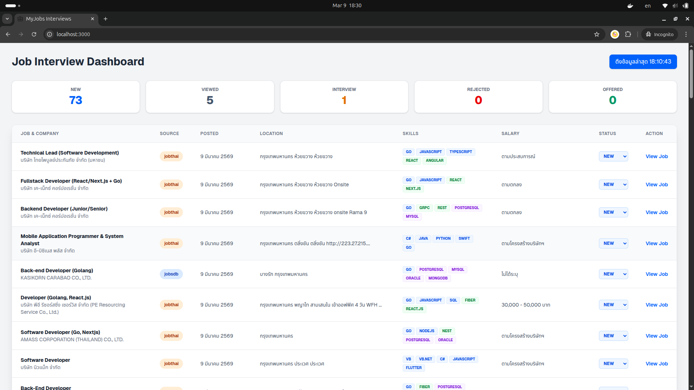

# Job Interview Dashboard


โปรเจกต์นี้เป็นระบบ Dashboard สำหรับจัดการและติดตามสถานะการสมัครงาน (Job Application Tracking) ที่ช่วยให้ผู้ใช้งานสามารถบริหารจัดการรายการงานที่สนใจหรือสมัครไปแล้วได้อย่างมีประสิทธิภาพ



## 🎯 จุดประสงค์ของโปรเจกต์
1. เพื่อรวบรวมข้อมูลงานจากแหล่งต่างๆ (เช่น JobsDB) มาไว้ในที่เดียว
2. เพื่อติดตามสถานะการสมัครงานในแต่ละขั้นตอน (New, Viewed, Interview, Rejected, Offered)
3. เพื่อวิเคราะห์ทักษะ (Skills) ที่จำเป็นในแต่ละตำแหน่งงานที่ระบบดึงข้อมูลมาได้
4. เพื่ออำนวยความสะดวกในการอัปเดตสถานะและเข้าถึงลิงก์ประกาศรับสมัครงานต้นทาง

## 🛠️ Tech Stack

### Frontend
- **Framework:** [Next.js 14+](https://nextjs.org/) (App Router)
- **Library:** [React](https://reactjs.org/) (Client Components)
- **Language:** [TypeScript](https://www.typescriptlang.org/)
- **Styling:** [Tailwind CSS](https://tailwindcss.com/)
- **Icons:** SVG Icons & Lucide-style animations

### Backend
- **Language:** [Go (Golang)](https://go.dev/)
- **Framework:** [Gin Gonic](https://gin-gonic.com/)
- **Dependency Injection:** [Google Wire](https://github.com/google/wire)
- **Database:** [MongoDB](https://www.mongodb.com/)
- **AI Analysis:** [Ollama](https://ollama.com/) (Model: `typhoon2.5-qwen3-4b`) สำหรับวิเคราะห์ทักษะจากรายละเอียดงาน
- **Containerization:** Docker & Docker Compose

### API Connection (Frontend)
- เชื่อมต่อกับ REST API ที่ `http://localhost:8077/api/v1`
- รองรับการทำงานร่วมกับระบบ Cron Job สำหรับการทำ Web Scraping

## 🚀 คุณสมบัติและการทำงานของระบบ

### 1. ระบบ Dashboard สรุปสถานะ
- แสดงการนับจำนวนงานแยกตามสถานะต่างๆ ในรูปแบบการ์ดที่สวยงาม
- สามารถคลิกที่การ์ดสถานะเพื่อกรอง (Filter) รายการงานในตารางได้ทันที

### 2. ระบบจัดการรายการงาน (Job Management)
- แสดงรายละเอียดงานครบถ้วน: ชื่อตำแหน่ง, บริษัท, แหล่งที่มา (Source), วันที่โพสต์, สถานที่ทำงาน, และเงินเดือน
- **Skill Analysis:** แสดง Tag ทักษะที่แยกประเภทตาม Languages, Frameworks และ Databases
- **Status Update:** สามารถเปลี่ยนสถานะงานได้โดยตรงจาก Dropdown ในตาราง
- **Auto-Viewed:** ระบบจะเปลี่ยนสถานะเป็น "Viewed" ให้โดยอัตโนมัติเมื่อผู้ใช้คลิกปุ่ม "View Job" เพื่อไปดูรายละเอียดที่เว็บต้นทาง

### 3. ระบบควบคุมการดึงข้อมูล (Scraping Control)
- มีปุ่มสำหรับสั่งการให้ Server เริ่มดึงข้อมูลงานใหม่ (Active Scraping)
- แสดงสถานะการทำงานของ Server (Processing status) แบบ Real-time
- แสดงเวลาล่าสุดที่มีการดึงข้อมูลสำเร็จ

## 💻 การติดตั้งและเริ่มใช้งาน

1. ติดตั้ง dependencies:
   ```bash
   npm install
   ```

2. รันโปรเจกต์ในโหมด Development:
   ```bash
   npm run dev
   ```

3. เปิด Browser ไปที่ http://localhost:3000